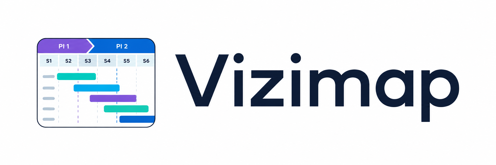

# 

A standalone, single-file HTML Gantt chart for product roadmaps — built to plan and present Program Increments, Sprints, and task activity in one clean view, and export it straight into a leadership brief.

No install, no build step, no backend. Open `index.html` in a browser and it works.

## What makes it different from a normal Gantt chart

Program Increment and Sprint timelines are overlaid as bands at the top of the chart, with dashed vertical gridlines marking their boundaries straight down through the task rows below — so it's immediately visible which sprint (and which PI) any given task falls into, not just its raw calendar dates. Tasks are grouped into named Lanes (swimlanes), and a same-day task automatically renders as a diamond milestone marker instead of a bar.

## Status

Feature-complete and in active use. The core tool — roadmap authoring, lanes, milestones, descriptions, PNG export, persistence, and a custom Vizimap visual theme — is built and stable. Ongoing work is refinement rather than new capability: see the [tracking issue](https://github.com/m3rrym4n/vizimap/issues/8) for what's currently being polished.

## Features

**Roadmap structure**
- Program Increments and Sprints, overlaid as bands at the top of the chart, with dashed alignment gridlines running down through the tasks below
- Tasks organized into named, reorderable Lanes (swimlanes) — multiple tasks share a lane's row instead of one row per task
- A same-day task automatically renders as a diamond milestone marker instead of a bar, and can be perched above or below its lane row (with a connector line) to avoid crowding

**Authoring, in the app**
- Full add/edit/delete for Program Increments, Sprints, Lanes, and Tasks via a Configure screen — no code editing required
- Per-task, per-Program-Increment, and per-Lane manual color pickers, overriding the active theme's defaults where set
- A Chart / Configure toggle keeps editing and viewing cleanly separate

**Descriptions, three ways**
- Hover tooltip — a quick-glance summary
- Click-to-overlay — a dismissible on-chart dialog with the full text
- Chart-baked display — place a description above or below a task, or inline inside a task bar, so it remains visible in an exported PNG (milestones fall back above the diamond for inline display)

**Presentation**
- A custom Vizimap visual theme (matching the logo palette), plus ten of Plotly's built-in themes, all selectable from Chart Settings
- Editable Chart Header and Chart Footer text
- High-resolution PNG export via Plotly's native export button, with a dated filename
- Configurable x-axis tick labels: plain calendar dates, or aligned to Sprint or PI names

**Persistence**
- Open and Save a roadmap directly as a `.json` file via the File System Access API — edits happen in place, no server, no download-then-replace step
- Opens with built-in sample data if no file has been loaded yet, so `index.html` is useful with zero setup

## Using it

Open `index.html` in **Chrome or Edge**. (This is a deliberate choice, not a gap — roadmap save/load uses the File System Access API, which only Chromium browsers support.)

## Architecture

- One file: `index.html`. HTML, CSS, and JS all inline.
- [Plotly.js](https://plotly.com/javascript/) loaded from a CDN, pinned to a specific version — no npm, no bundler, no other dependencies.
- Gantt bars, PI bands, and Sprint bands all use the same technique: horizontal bars on a date-typed axis. Milestones (same-day tasks) render as diamond-symbol markers on the same axis instead.

## Contributing

This repo is built issue-by-issue by an autonomous coding agent (Codex, dispatched via [Variflex](https://github.com/m3rrym4n/variflex)) against a fixed set of standing rules. See [`AGENTS.md`](./AGENTS.md) for the full architecture, scope, and working philosophy this repo is held to.

## Acknowledgments

Vizimap's chart rendering is built on [Plotly.js](https://plotly.com/javascript/), loaded via CDN and used under its [MIT License](https://github.com/plotly/plotly.js/blob/main/LICENSE). Plotly.js is copyright Plotly, Inc. — this project bundles none of its source, but the charting engine that makes Vizimap possible is entirely theirs.

## License

[MIT](./LICENSE) — see the LICENSE file for the full text.
